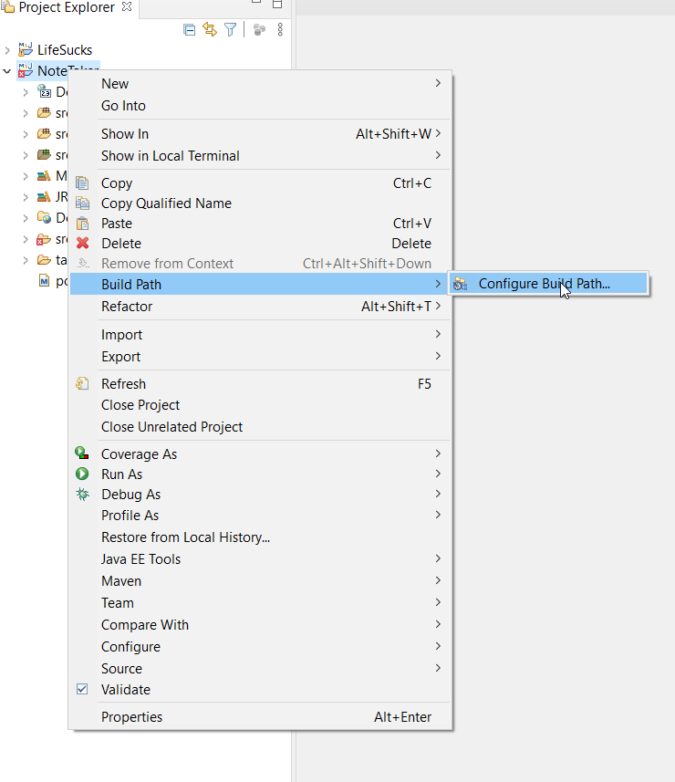
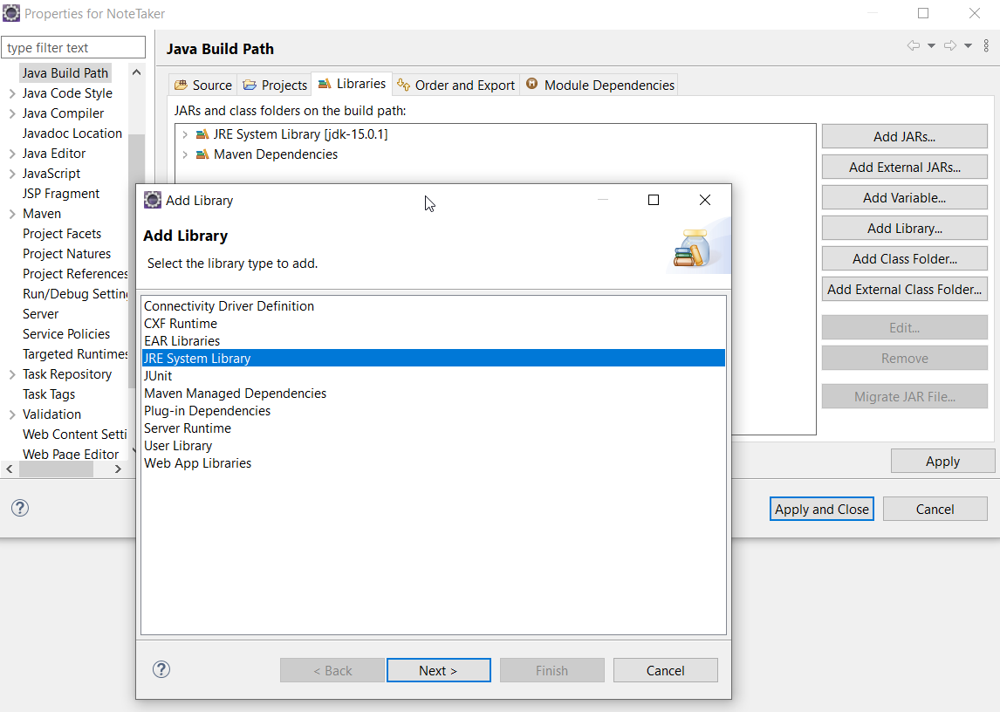
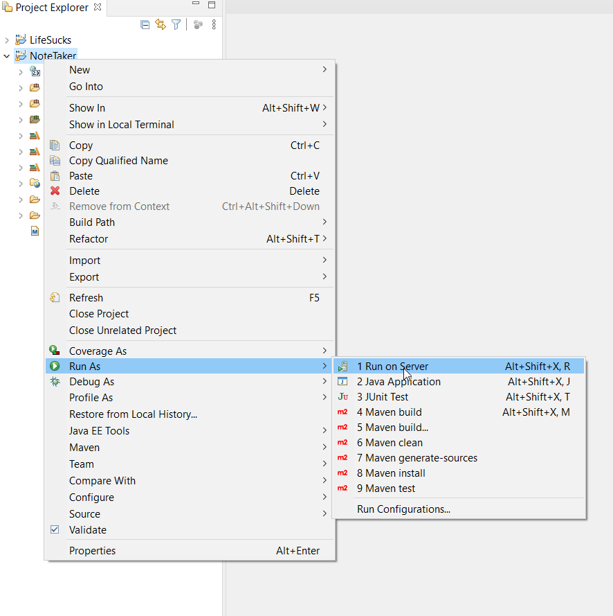
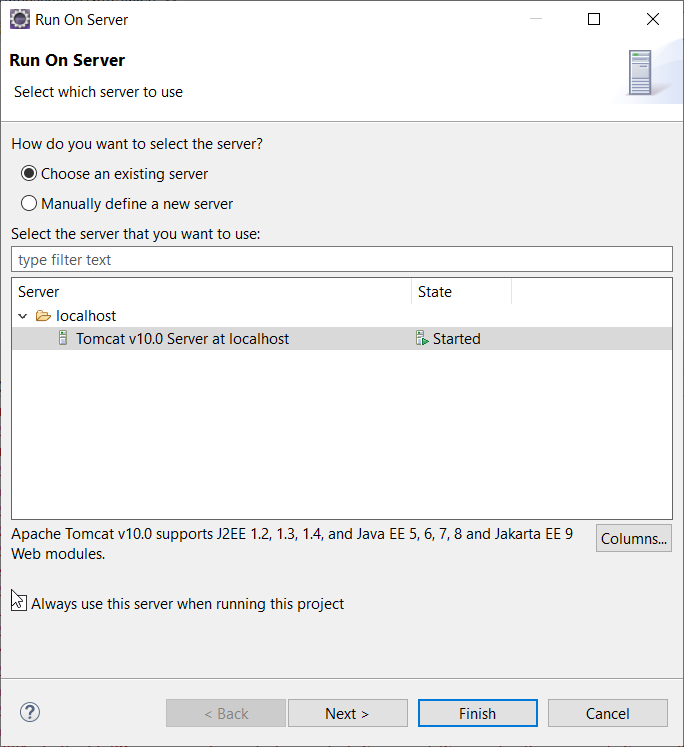
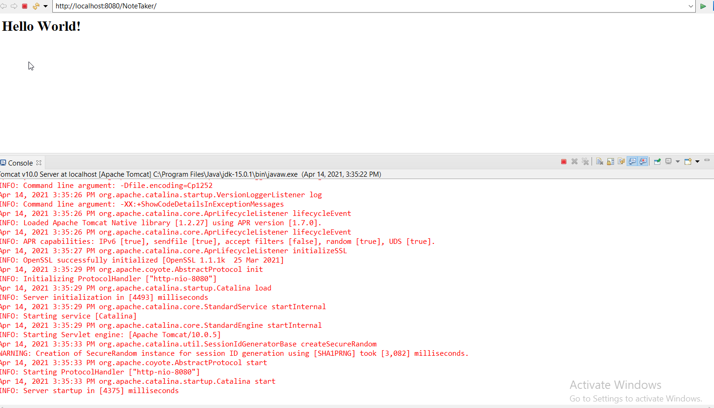
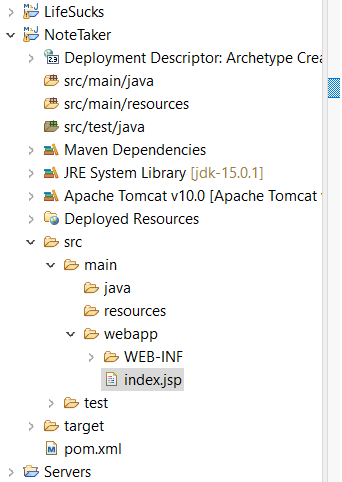
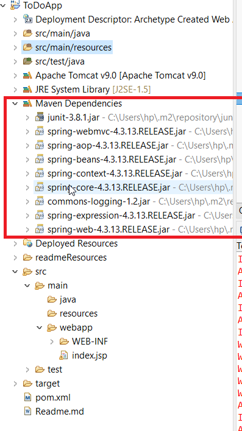
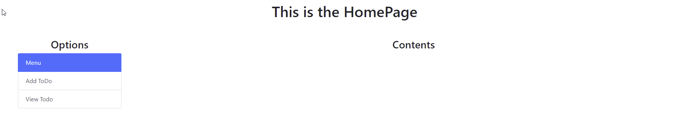
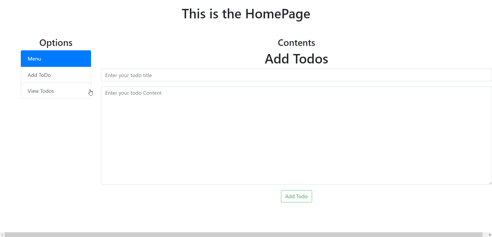

# Documentation of the Project  [](https://github.com/sindresorhus/awesome#readme)
> A very simple web based note taker app.


<br />
<p align="center">
    
  </p>

  <h3 align="center">NoteTaker App</h3>


  <!-- TABLE OF CONTENTS -->
  <details open="open">
    <summary>Table of Contents</summary>
    <ol>
      <li>
        <a href="#about-the-project">About The Project</a>
      </li>
      <li><a href="#built-with">Built With</a></li>
      <li><a href="#getting-started">Getting started</a></li>
    </ol>
  </details>


## About the Project

We are gonna make a basic web based ToDo app that will perform basic CRUD operation. We are gonna use hibernate to handle the database and as database we will be using MYSQL. We will also use MVC design-pattern.

## Built With

The project will be built with:

1. Hibernate
2. MYSQL
3. Java Spring
4. Servelet
5. JSP etc

## Getting started

1. First step is to start a maven project for simplicity of injecting dependencies. For archetype we have selected `maven-archetype-webapp`.
2. Then we update the library.

      * first we update the jdk

        ***Right Click on project -> Build path -> Configure Build path -> Add library -> JRE System Library -> next-> Default workstation Library (JDK - 15) -> finish***

        <p align="center">
            
              
          </p>
      * Then we remove the old J2SE-1.5 (default JRE system library)
        Similarly now we add tomcat server to our project.

        ***Right Click on project -> Build path -> Configure Build path -> Add library -> Server Runtime -> next-> Tomcat -> finish***

        But since we did not have tomcat server downloaded we had to download it first and then add it. The installation of tomcat and adding it to eclipse guide can be found [here]( https://www.eclipse.org/webtools/jst/components/ws/1.0/tutorials/InstallTomcat/InstallTomcat.html#:~:text=Start%20the%20Eclipse%20WTP%20workbench,under%20Apache%20(Apache%20Tomcat%20v5. )

        Now we check if our project is working. To do that, we ***right click project -> run as -> run on server -> apahe tomcat -> finish***

        <p align="center">
            
              
          </p>

        And we see a successful hello world message, which should tell us that our app is good to go.  
        <p align="center">
        
        </p>


## Adding Bootstrap

Now we add some bootstrap to our project. We copy & paste the html code from _getting started -> starter template_ from [getbootstrap.com]( https://getbootstrap.com ) to our index.jsp file.

<p align="center">

</p>

Now we can see our hello world is much more beautiful now.

## Configuring Project

First we need to follow the five step to configure spring MVC project. In this project we will use xml file but we can do it by java coding too.

* ***Add Dependency:*** First we add the maven dependency in our pom.xml file. For this project, we are using 4.3.13 version of the spring MVC.
We can see the jar files added by maven automatically.

<p align="center">
        
</p>

1. ***Specifying Front Controller:*** We need to specify our front controller (Dispatcher Servlet).We first locate the web.xml file.

```bash
├───src
│   ├───main
│   │   ├───java
│   │   ├───resources
│   │   └───webapp
│   │       └───WEB-INF
                └───web.xml
```

We copy-paste the following snippet into it between `<web-app>` tag.

```xml
<servlet>
        <servlet-name>todo</servlet-name>
                <!-- the name of our project-->
        <servlet-class>org.springframework.web.servlet.DispatcherServlet</servlet-class>
                <!-- Specifying our dispatcher servlet (our front controller)-->
        <load-on-startup>1</load-on-startup>
                  <!-- Don't know what this does -->
</servlet>

<servlet-mapping>
        <servlet-name>todo</servlet-name>
            <!-- the name to our project name-->
        <url-pattern>/todo/*</url-pattern>
            <!-- all the url after with todo prefix will be handled by our front controller-->
            <!--  <url-pattern>/</url-pattern> would mean dispatcher servlet will handle all url-->
</servlet-mapping>
```

2. ***Create and configure servlet xml file:*** We create a `todo-servelet.xml` file in the same directory of `web.xml` file. The `todo` comes from the `<servlet-name>todo</servlet-name>` portion of our `web.xml` file.

Then we paste the following snippet into it.

```xml
<?xml version="1.0" encoding="UTF-8"?>
<beans xmlns="http://www.springframework.org/schema/beans"
    xmlns:mvc="http://www.springframework.org/schema/mvc"
    xmlns:xsi="http://www.w3.org/2001/XMLSchema-instance"
    xsi:schemaLocation="
        http://www.springframework.org/schema/beans
        http://www.springframework.org/schema/beans/spring-beans.xsd
        http://www.springframework.org/schema/mvc
        http://www.springframework.org/schema/mvc/spring-mvc.xsd">

    <mvc:annotation-driven />

</beans>
```

This will enable us to use `@Controller` annotation.

3. ***Create a controller:*** Now we create a controller class name `HomeCtrl` in `com.ctrl` package in the `src\main\java` directory. We add `@Controller` annotation above the class to specify it as a controller. We add a method `home` and add annotation `@RequestMapping("\home")` to specify that when `\home` url is hit this method will handle the request(`GET` request by default) and this method return a string "home" which indicate the name of the view that will be displayed.


4. ***Add a component scanner:*** We need to tell spring to scan `com.ctrl` package to get the controllers. So we add the following snippet in the `todo-servlet.xml` file.

```xml
... ... ...

<context:component-scan base-package="com.ctrl"/>
<mvc:annotation-driven />
```

the we copy the last two lines of the schemaLocation tag and paste it and edit the mvc part to context and also xmlns:mvc tag is copy pasted and edited accordingly.

```xml
... ... ...

  xmlns:mvc="http://www.springframework.org/schema/mvc"
  <!--copy and pasted and edite -->
  xmlns:context="http://www.springframework.org/schema/context"

.... ....

xsi:schemaLocation="
    http://www.springframework.org/schema/beans
    http://www.springframework.org/schema/beans/spring-beans.xsd
    http://www.springframework.org/schema/mvc
    http://www.springframework.org/schema/mvc/spring-mvc.xsd

    <!-- copy and edited -->
    http://www.springframework.org/schema/context
    http://www.springframework.org/schema/context/spring-context.xsd

    ">


<context:component-scan base-package="com.ctrl"/>
<mvc:annotation-driven />
```

5. ***Add a view resolver:*** Now we need to add a view resolver so that spring knows where to look for the views.

So we add the following snippet.

```xml
<context:component-scan base-package="com.ctrl"/>

	<bean id="viewResolver" class="org.springframework.web.servlet.view.InternalResourceViewResolver">
					<!-- the class name can be found by pressing ctrl+shift+t inside a java class in eclipse and typing internares -->
					<!-- the class name can also be found from interet -->

						<!-- the properties come from inside the viewResolver class -->
					<property name="prefix" value="/WEB-INF/pages/"/>
						<!-- Spring will look for the page in the /WEB-INF/Pages/ directory -->
					<property name="suffix" value=".jsp"/>
						<!-- The webpages will end with .jsp extension -->
	</bean>

    <mvc:annotation-driven />
```

So we create our `home.jsp` file (returned in our home mehtod of the HomeCtrl)
in the `/WEB-INF/Pages` directory.

So we create a `home.jsp` file in the same directory as `index.jsp` file.

```bash
├───src
│   ├───main
│   │   ├───java
│   │   ├───resources
│   │   └───webapp
│   │       └───...
            └───Pages
                └───home.jsp
            └───index.jsp

```

So that should do it. If we run the project we will first see the index page. And if we go to `/home` url we will see the home page which was configured using spring mvc.

***NOTE:*** We faced some hickups due to the bug of eclipse reversing back to java old version. After reconfiguring with the latest java the error was gone.

Now for convenience, we redirect to our home page  in the index page so both acts like our front page.
We use our good-old `<% %>` tags to do it.

```java
<%
     //Lets redirect the page to our home page
     response.sendRedirect(request.getContextPath()+"/home");
     //This is a bit old method
%>
```

## Designing Home Page UI

Okay so we pasted bootstrap starter template in our home.jsp. Now Lets add a container and add a title inside it (also centering the title)

Then we add row-column div tag to create two column one containing the options and the other containing contents.
Then in the options column we add bootstrap list-button (after googling,then copy pasting the template and editing to our preferences) to our page. Then we get the followling which does not do anything now.

<p align="center">
    
</p>


## Sending Data to View from Controller

There are two main ways(out of many ways) to send data from controller to view. They archetype
1. Using Model
2. Using ModelAndView

We will be using Model here first. The code snippet:

```java
@RequestMapping("/home")
	public String home(Model model)
	{
		String value = "This is the value i want to send";
		model.addAttribute("key",value);//string is the name of the key or
    //variable that we will access in the view
    // and value is an object that is mapped to this
    //key that we will get in view through key
		return "home";
	}
```

Now to accept and use this value in the view we can use `<% %>` tag but instead we will use jstl for this because it is standard.

To use jstl we will firs include the dependency of jstl( google "jstl maven" and we select 1.2 version) in the pom.xml. Then we add jstl uri (by googling "jstl core uri") add the top of the page and also we set `isELIgnored` value to be false.

```java
<%@ taglib prefix="c" uri="http://java.sun.com/jsp/jstl/core" %>
<%@page isELIgnored="false" %>
```

Then we print the value sent by controller by following snippet.
```java
<h1> <c:out value="${key}"></c:out>  </h1>
```

Now lets add if condition in our view so that our view is displayed on condition of the data send by controller. Lets choose what to be shown in the view by value of `page` variable sent by our controller.

```html
<c:if test="${page=='home'}">
<h1 class="text-center"> All Todos</h1>
</c:if>

<c:if test="${page=='add'}">
<h1 class="text-center"> Add Todos</h1>
</c:if>
```
## Add url to menu options

Now We add url to our menu option using jstl tag (we use jstl tags becuase it helps us to add relative url).

```java
<a href='<c:url value='/add'></c:url>'
class="list-group-item list-group-item-action">Add ToDo</a>

<a href='<c:url value='/home'></c:url>'
class="list-group-item list-group-item-action">View Todo</a>
```
then we setup the controller to handle those url request.

```java
@RequestMapping("/add")
	public String addToDo(Model model)
	{
		model.addAttribute("page","add");
		return "home";
	}
```

So now the content of the same home page changes upon clicking on one of the menu options.

## Receive data from the view

To receive data from the view we need to add a form. Traditionally we would use normal html and then extract the form data using `request.getParameter("id")` where id would be the id of a field of the form. We would recieve the data as string and would have to later typecast if necessary. But this is a bit tedious if the form is too big and since most of the time we just save the data from the form into an entity we can make this process easier by using `@modelAttribute("")` annotation and spring-form altogether.

To do this we first create an entity class "Todo" in `com.entities` package. We add the field we need for this entity.

```java
public class Todo {
	private String todoTitle;
	private String todoContent;
	private Date todoDate;
}

```
and then we add necessary constructor and getter and setters.

Now to use the spring-form in our view we add spring-form uri at the top of the `home.jsp` page.

```html
<%@ taglib prefix="form" uri="http://www.springframework.org/tags/form" %>  
```
Before we write the form in our page, since the form will be mapped with an entity we need to make the entity object available in our view to be used.
The object taht we will send is just a non initialized instance.

```java
@RequestMapping("/add")
	public String addToDo(Model model)
	{
    Todo t = new Todo();
		model.addAttribute("todo",t);
        //We are sending the entity to the view to be used in the form for mapping

		model.addAttribute("page","add");
		return "home";
	}
```

Then we add the spring form in the if condition of the view where page is equal to add.

```html
    <!-- action="saveToDo" adds relative url -->
<form:form action="saveToDo" method="post" modelAttribute="todo">
          <!-- the todo of modelAttribute="todo" comes from the controller which tells spring what entity to used for mapping-->
	<!-- the action and method part of the form is traditional -->
	<!-- the model attribute value will be used in the controller to recognize the form to be mapped with the entity -->

	<div class="form-group">
		<form:input cssClass="form-control"
			placeholder="Enter your todo title" path="todoTitle" />
					<!-- the path has to match exactly the variable name in the entity class-->
	</div>

	<div class="form-group">
		<form:textarea cssClass="form-control" cssStyle="height:300px"
			placeholder="Enter your todo Content" path="todoContent" />
	</div>

	<div class="container">
		<button class="btn btn-outline-success text-center">Add Todo</button>
	</div>

</form:form>
```

The path field is very important here. This has to be exactly the name of the variable of the entity class in which we want to save this field's data.

Now since the form action hits `saveTodo` url we need to add a method for it in our controller.

```java
@RequestMapping(value="/saveTodo",method=RequestMethod.POST)
	public String saveTodo(@ModelAttribute("todo") Todo t,  Model model)
	{
		System.out.println(t);
		return "home";
	}
```
`@ModelAttribute` annotation is used to get the form mapped into the object t. Now all we have to do is use ORM to save the object into our database.


<p align="center">
    
  </p>


## Saving the data Without a Database

Now we can actually save the data without a permanent database. But that would mean the data would be lost every time the server is restarted.
But to keep the data as long as the server run we can use the `context` object which would be initiated at the beginning of running the server and is available to us as long as the server runs.

We create a `MyListener` class in `com.listener` package which implements `ServletContextListener`. Then we override the two `contextDestroyed` and `contextInitialized` method.

```java
public class MyListener implements ServletContextListener{

	public void contextDestroyed(ServletContextEvent sce) {
		// TODO Auto-generated method stub
	}

	public void contextInitialized(ServletContextEvent sce) {
		// TODO Auto-generated method stub
		System.out.println("Context Created");
			//This method will be called when a context is created
			//When the server is started the context will be created

		List<Todo> list = new ArrayList<Todo>();
		ServletContext context = sce.getServletContext();
				//This ServletContext object is a singletone and only one is created througout the project
		context.setAttribute("list", list);
	}
}
```

Now we need to edit the `web.xml` file to acknowledge this listener class.
```xml
<listener>
    	<listener-class>com.listener.MyListener</listener-class>
</listener>
```

Now we declare a `ServletContext` obeject context in the controller class and bind it to the singletone `ServletContext` object of the project using `@Autowired` annotation.

```java
@Controller
public class HomeCtrl {

	@Autowired
	ServletContext context;
	... ...
```


Now we edit the `saveToDo` method to get the existing list of entries from the context object and add the new entry to the list.

```java
@RequestMapping(value="/saveTodo",method=RequestMethod.POST)
	public String saveTodo(@ModelAttribute("todo") Todo t,  Model model)
	{
		t.setTodoDate(new Date());
		System.out.println(t);

		List<Todo> list = (List<Todo>)context.getAttribute("list");
			//Get the already existing lists
		list.add(t);
			//adding our new entry to the lists
		model.addAttribute("msg","Successfully entry added ...");
        // A message to be shown on the view so that user know the entry is saved
		return "home";
	}
```

We edit  the view a bit so that we can see a success message upon the data is saved.

```html
<c:if test="${not empty msg}">
	<div class="alert alert-success">
	<b><c:out value="${msg}"></c:out></b>
	</div>
</c:if>
```
